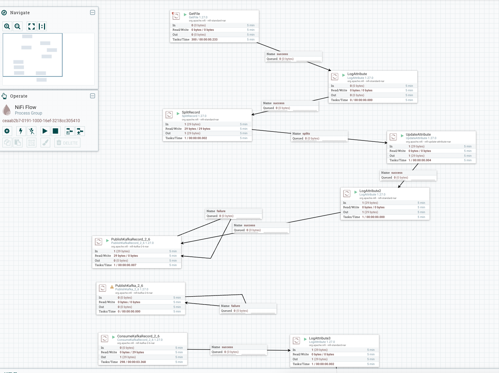
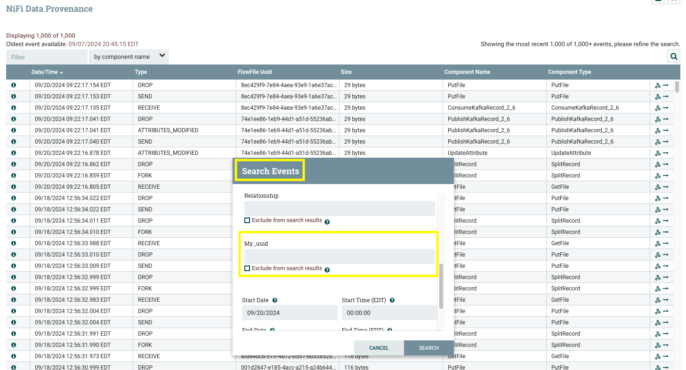

# Notes

## Sample Flow

### GetFile
* Pulls a file from a local directory (nifi/data-in) into a Flowfile

### LogAttribute
* Logs all Flowfile attributes to nifi/logs/app.log

### SplitRecord
* Pulls apart the Flowfile into seperate Flowfiles with the header from the source as the first line in each record, split on '\n'

### Update Attribute
* Set filename to: `${filename:append('.'):append(${now():toNumber()}):append('.'):append(${fragment.index})}`
* Set my_uuid to: `${UUID()}`
* Set theCount to `${getStateValue("theCount"):plus(1)}`  *- Not currnetly used for anything*

### LogAttibute2
* Logs all Flowfile attributes to nifi/logs/app.log

### PublishKafkaRecord_2_6
* Set `Attrubutes to send as Headers` to `.*` *This puts all the attributes into the kafka headers*

### ConsumeKafkaRecord_2_6
* Set `Headers to set as Attributes` to `.*` *This pulls all headers into the Flowfile attributes

### LogAttribute3
* Logs all Flowfile atttributes to nifi/logs/app.log

## Random things
* Redpanda exposed Docker port is localhost:19092 which is what is used in Nifi
* Update nifi.properties field `nifi.provenance.repository.indexed.attributes` to `my_uuid` to add the custom attribute to the index and make it searchable
